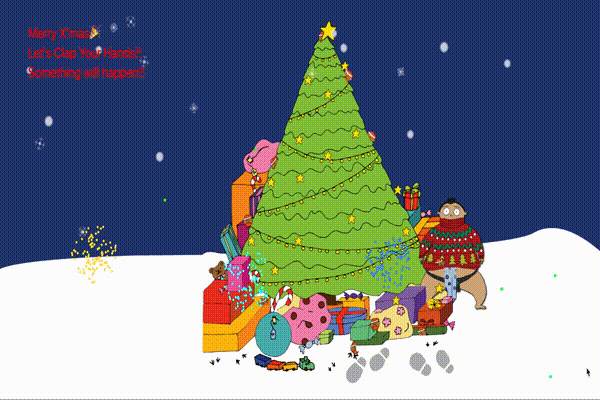

# xmas-fireworks
Sample image


This is [demo](https://xmas-fireworks.herokuapp.com/)

## HOW TO USE
Just start with npm install & run.
``` bash
$ npm install
$ npm run dev
```

## HOW TO PLAY
| MOVE | CLAP HANDS |
|:-----------|:------------|
| If you move between left and right, falling tetris block will follow with you.| Every time you clap your hands, fireworks and snows will show up. |

## PERFORMANCE
If you have great GPU, this sample might be by far faster because Tensorflow.js applies WebGL for calclation, which means depends on your GPU spec.

---

Game logic is inspired in [this code](https://github.com/CodingTrain/website/tree/master/CodingChallenges/CC_027_FireWorks). Thank you for sharing.
To detect human pose, this system introduce *Tensorflow.js* and reference [sample code](https://developers.gnavi.co.jp/entry/posenet/hasegawa).
